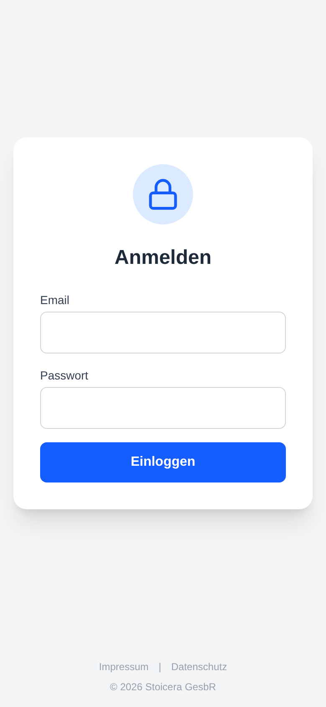
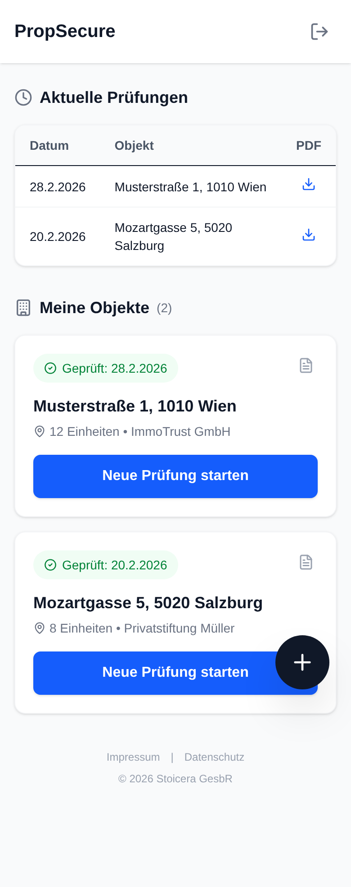
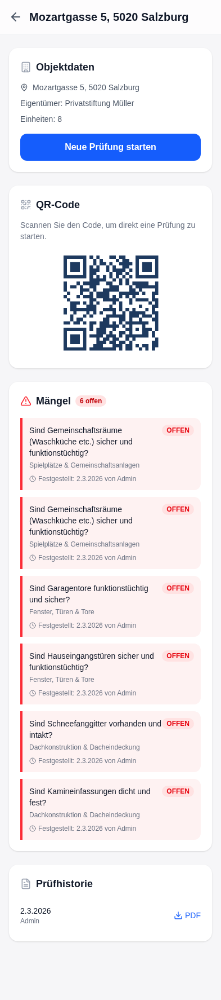
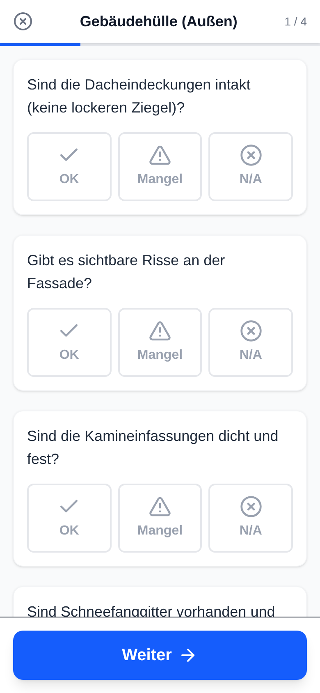
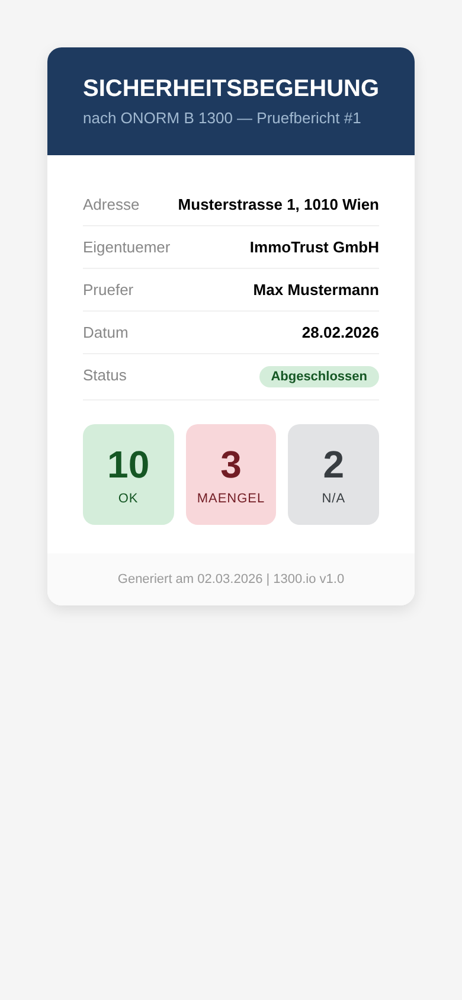
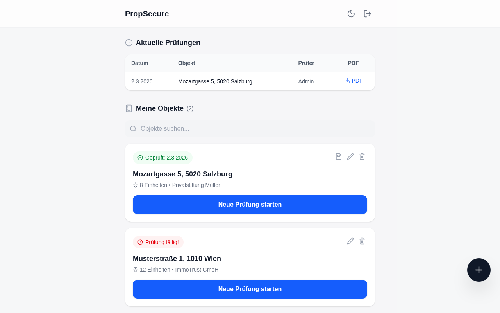
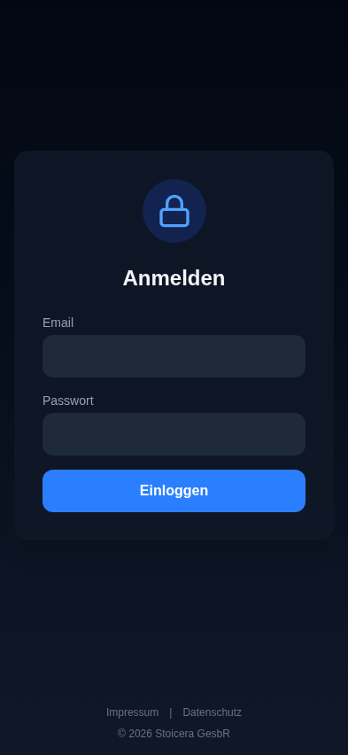
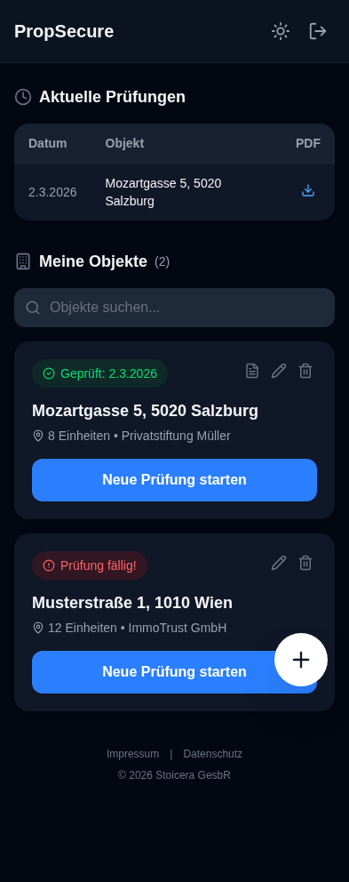
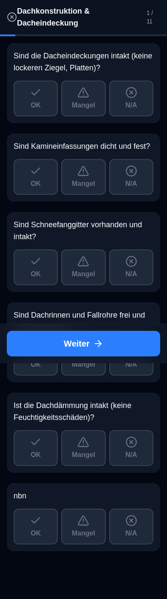

<p align="center">
  <h1 align="center">1300.io</h1>
  <p align="center">
    Open-source SaaS platform for Austrian property safety inspections<br />
    following <strong>ÖNORM B 1300</strong>
  </p>
</p>

<p align="center">
  <a href="#quick-start"><strong>Quick Start</strong></a> &middot;
  <a href="#screenshots"><strong>Screenshots</strong></a> &middot;
  <a href="#architecture"><strong>Architecture</strong></a> &middot;
  <a href="#configuration"><strong>Configuration</strong></a> &middot;
  <a href="#contributing"><strong>Contributing</strong></a>
</p>

---

## Overview

1300.io is a mobile-first inspection platform built for Austrian property managers (*Hausverwaltungen*). It streamlines the legally mandated ÖNORM B 1300 safety inspection workflow — from on-site checklist completion to professional PDF report generation — in a single, paperless application.

**Walk through a building with your phone, answer standardized checklist items, photograph defects on the spot, and generate a court-admissible PDF report in seconds.**

### Key Features

- **Mobile-first UI** — Designed for one-handed operation during on-site inspections, with iOS-style frosted glass design and full dark mode support
- **Integrated camera** — Document defects with photos directly within the inspection flow
- **Instant PDF reports** — Generate professional reports with embedded photos, compliant with Austrian legal standards
- **Complete audit trail** — Every inspection is logged with full traceability for liability protection
- **ÖNORM B 1300 checklists** — Pre-configured categories covering roof, facade, staircase, technical systems, and exterior areas
- **Role-based access** — Admin, Manager, Inspector, and Read-only roles with granular permissions
- **Multi-organization support** — Manage multiple property management companies from a single instance
- **Defect tracking** — Track defect lifecycle across inspections with automatic resolution detection

---

## Screenshots

### Light Mode

<table>
  <tr>
    <td align="center"><strong>Login</strong></td>
    <td align="center"><strong>Dashboard</strong></td>
    <td align="center"><strong>Property Detail</strong></td>
  </tr>
  <tr>
    <td></td>
    <td></td>
    <td></td>
  </tr>
  <tr>
    <td align="center"><strong>Inspection Wizard</strong></td>
    <td align="center"><strong>Inspection Complete</strong></td>
    <td align="center"><strong>Admin Panel</strong></td>
  </tr>
  <tr>
    <td></td>
    <td></td>
    <td></td>
  </tr>
</table>

### Dark Mode

<table>
  <tr>
    <td align="center"><strong>Login</strong></td>
    <td align="center"><strong>Dashboard</strong></td>
    <td align="center"><strong>Inspection Wizard</strong></td>
  </tr>
  <tr>
    <td></td>
    <td></td>
    <td></td>
  </tr>
</table>

<!-- Screenshots generated with: node take-screenshots.mjs -->

---

## Architecture

```
┌─────────────────┐         ┌─────────────────┐         ┌─────────────────┐
│     Client       │         │     Server       │         │    Database      │
│                  │         │                  │         │                  │
│  React 19        │  REST   │  Express 5       │  ORM    │  PostgreSQL 16   │
│  Vite 7          │◄───────►│  Prisma          │◄───────►│  (dev + prod)    │
│  Tailwind CSS 4  │  JSON   │  JWT Auth        │         │                  │
│                  │         │  PDFKit, Sharp   │         │                  │
└─────────────────┘         └─────────────────┘         └─────────────────┘
       :5173                       :3000
```

The project is organized as a monorepo with two packages:

| Package | Stack | Purpose |
|---------|-------|---------|
| `client/` | React 19, Vite 7, Tailwind CSS 4 | Mobile-first SPA with iOS-style UI and dark mode |
| `server/` | TypeScript 5.9 (strict), Express 5, Prisma ORM, PDFKit, Sharp | REST API, JWT auth, PDF generation, image optimization |

### Further reading

- [docs/ARCHITECTURE.md](docs/ARCHITECTURE.md) — request lifecycle, data model, extension points
- [docs/DEPLOYMENT.md](docs/DEPLOYMENT.md) — production deploy with docker-compose and GHCR
- [docs/RUNBOOK.md](docs/RUNBOOK.md) — logs, metrics, backups, secret rotation, incident response
- [SECURITY.md](SECURITY.md) — vulnerability disclosure
- [CONTRIBUTING.md](CONTRIBUTING.md) — dev setup and code style
- API docs: `/api/docs` (Swagger UI) and `/api/openapi.json` (raw spec) once the server is running

---

## Quick Start

### Prerequisites

- **Docker** and **Docker Compose** (recommended)
- Or: Node.js 22+ and npm 10+ for local development
- Linux, macOS, or Windows (WSL recommended)

### Using Docker (recommended)

```bash
# Clone the repository
git clone https://github.com/Artaeon/1300io.git
cd 1300io

# Configure environment
cp .env.example .env
# Edit .env — at minimum, set a strong JWT_SECRET

# Start all services
docker-compose up -d --build

# Initialize the database (first run only)
docker-compose exec server npx prisma db push
docker-compose exec server node prisma/seed.js
docker-compose exec server node seed_user.js
```

The application is now available at:
- **Frontend:** http://localhost:5173
- **API:** http://localhost:3000

> **Note:** The seed user script reads `ADMIN_EMAIL`, `ADMIN_PASSWORD`, and `ADMIN_NAME` from your `.env` file.

### Local Development (without Docker)

```bash
# Backend
cd server && npm install && npm run dev

# Frontend (separate terminal)
cd client && npm install && npm run dev
```

The Vite dev server proxies `/api` and `/uploads` requests to the Express backend automatically.

---

## Production Deployment

```bash
docker-compose -f docker-compose.prod.yml up -d --build

# Run migrations and seed (first deployment only)
docker-compose -f docker-compose.prod.yml exec server npx prisma db push
docker-compose -f docker-compose.prod.yml exec server node prisma/seed.js
docker-compose -f docker-compose.prod.yml exec server node seed_user.js
```

### Production Checklist

| Requirement | Details |
|------------|---------|
| `JWT_SECRET` | Cryptographically random, at least 32 characters (`openssl rand -base64 32`) |
| `NODE_ENV` | Set to `production` |
| `FRONTEND_URL` | Your exact frontend domain (for CORS) |
| `DATABASE_URL` | PostgreSQL connection string (not SQLite) |
| HTTPS | Terminate at your reverse proxy (nginx, Caddy, Traefik, etc.) |

---

## Configuration

All configuration is managed through environment variables. See `.env.example` for the complete list.

| Variable | Required | Default | Description |
|----------|:--------:|---------|-------------|
| `JWT_SECRET` | Yes | — | Secret key for signing JWT tokens |
| `DATABASE_URL` | Yes | `file:./dev.db` | Database connection string |
| `PORT` | No | `3000` | Express server listen port |
| `NODE_ENV` | No | `development` | Environment (`development` / `production`) |
| `FRONTEND_URL` | No | `http://localhost:5173` | Allowed CORS origin |
| `UPLOAD_DIR` | No | `./uploads` | Directory for uploaded inspection photos |
| `LOG_LEVEL` | No | `info` | Logging verbosity (`fatal` / `error` / `warn` / `info` / `debug` / `trace`) |
| `ADMIN_EMAIL` | No | — | Email for the seed admin user |
| `ADMIN_PASSWORD` | No | — | Password for the seed admin user |
| `ADMIN_NAME` | No | `Admin` | Display name for the seed admin user |

> **Security:** Never commit `.env` files. Use at least 32 characters of random data for `JWT_SECRET`. Restrict `FRONTEND_URL` to your exact domain in production. Rotating `JWT_SECRET` invalidates all active sessions.

---

## Authentication & Authorization

The API uses JWT bearer tokens issued on login (1-hour expiry).

| Role | Permissions |
|------|-------------|
| **Admin** | Full access — manage users, organizations, properties, checklists, and all inspections |
| **Manager** | Create and manage properties, view all inspections within their organization |
| **Inspector** | Create and complete inspections, upload defect photos |
| **Read-only** | View properties and download inspection reports |

---

## How It Works

```
  ┌──────────┐     ┌───────────┐     ┌──────────────┐     ┌────────────┐
  │  Login    │────►│ Dashboard  │────►│  Inspection   │────►│ PDF Report  │
  │           │     │            │     │  Wizard       │     │             │
  │ JWT Auth  │     │ Properties │     │ Checklist +   │     │ Professional│
  │ Role-based│     │ History    │     │ Camera +      │     │ with photos │
  │           │     │ Search     │     │ Defect docs   │     │ & signatures│
  └──────────┘     └───────────┘     └──────────────┘     └────────────┘
```

1. **Login** — Authenticate with your credentials. Role-based access controls determine available actions.
2. **Dashboard** — View managed properties, last inspection dates, and recent history. Start new inspections or download existing reports.
3. **Inspection Wizard** — Walk through the building with the mobile-optimized checklist. Each ÖNORM B 1300 category presents its items — mark as *OK*, *Mangel* (defect), or *N/A*. Document defects with photos and comments in real-time.
4. **PDF Report** — Generate a professional report with property details, summary statistics, all checklist results grouped by category, and a defect report section with embedded photos and signature fields.

---

## Data & Compliance

- **Audit trail** — All mutations are logged with actor, timestamp, IP address, and previous state
- **DSGVO/GDPR** — Privacy policy at `/datenschutz`; data export and deletion via the admin interface
- **Legal notice** — Impressum at `/impressum` as required by Austrian law (§ 5 ECG)
- **PDF reports** — Generated on-demand from inspection data; re-generation produces identical output
- **Data retention** — Inspection records retained indefinitely by default; configure retention as needed

---

## Testing

```bash
# Backend tests (112 tests)
cd server && npm test

# Frontend tests (8 tests)
cd client && npm test

# All tests from project root
npm test
```

---

## Tech Stack

| Layer | Technology | Version |
|-------|-----------|---------|
| Frontend | React | 19 |
| Build | Vite | 7 |
| Styling | Tailwind CSS | 4 |
| Backend | Express | 5 |
| ORM | Prisma | 6 |
| PDF | PDFKit | 0.16 |
| Auth | JWT (jsonwebtoken) | — |
| Validation | Zod | — |
| Database | SQLite (dev) / PostgreSQL (prod) | — |
| Container | Docker + Docker Compose | — |

---

## Security

To report a security vulnerability, see [SECURITY.md](SECURITY.md).

## Contributing

See [CONTRIBUTING.md](CONTRIBUTING.md) for development guidelines, branching model, and commit conventions.

## License

Distributed under the MIT License. See [LICENSE](LICENSE) for the full text.

---

<p align="center">
  Copyright &copy; 2026 <a href="https://stoicera.com">Stoicera GesbR</a>
</p>
